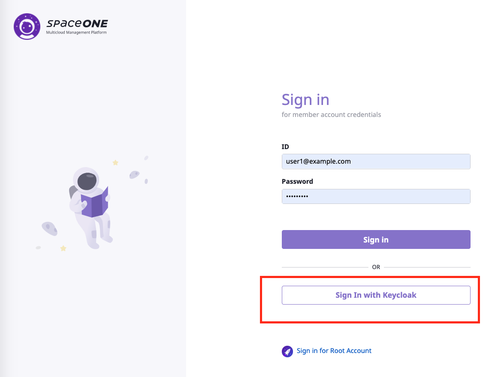
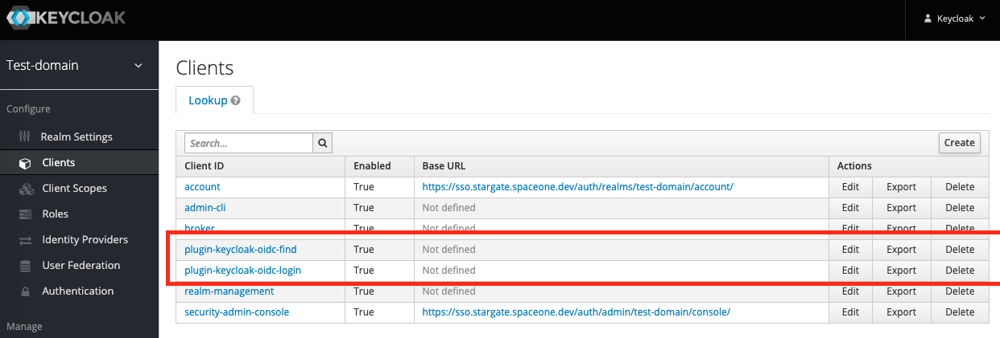
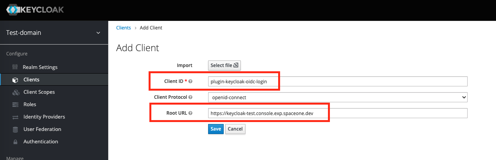
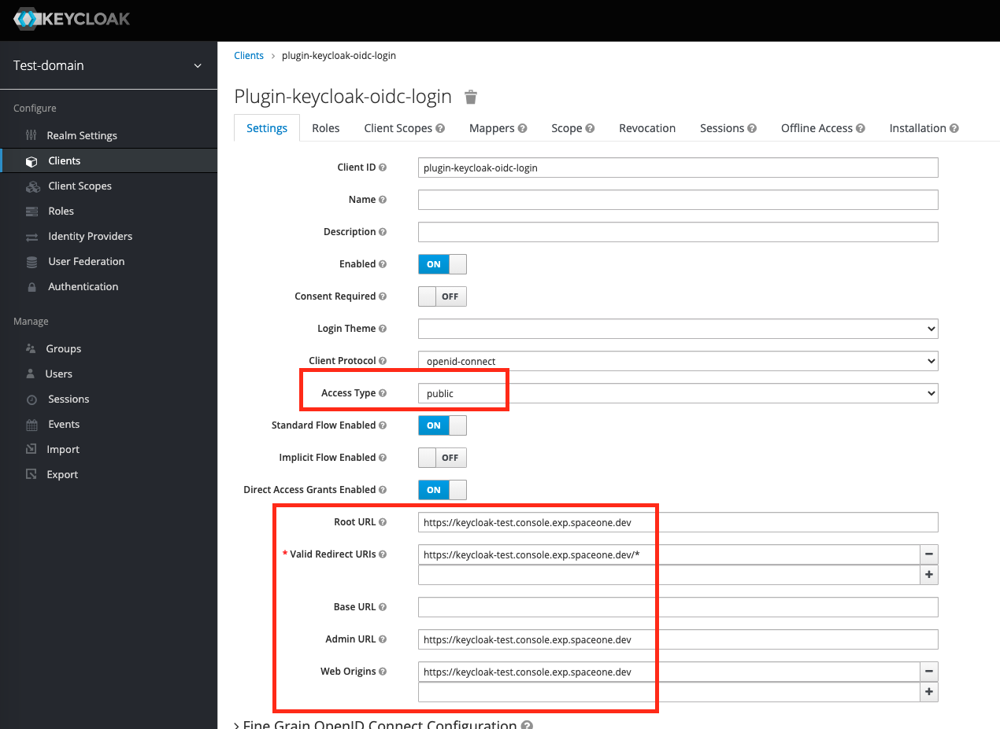
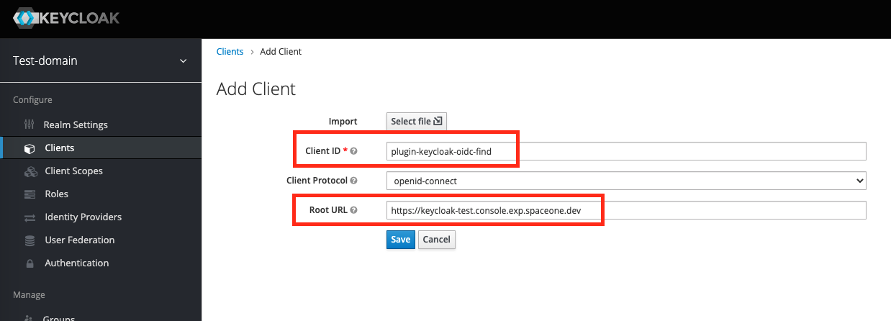
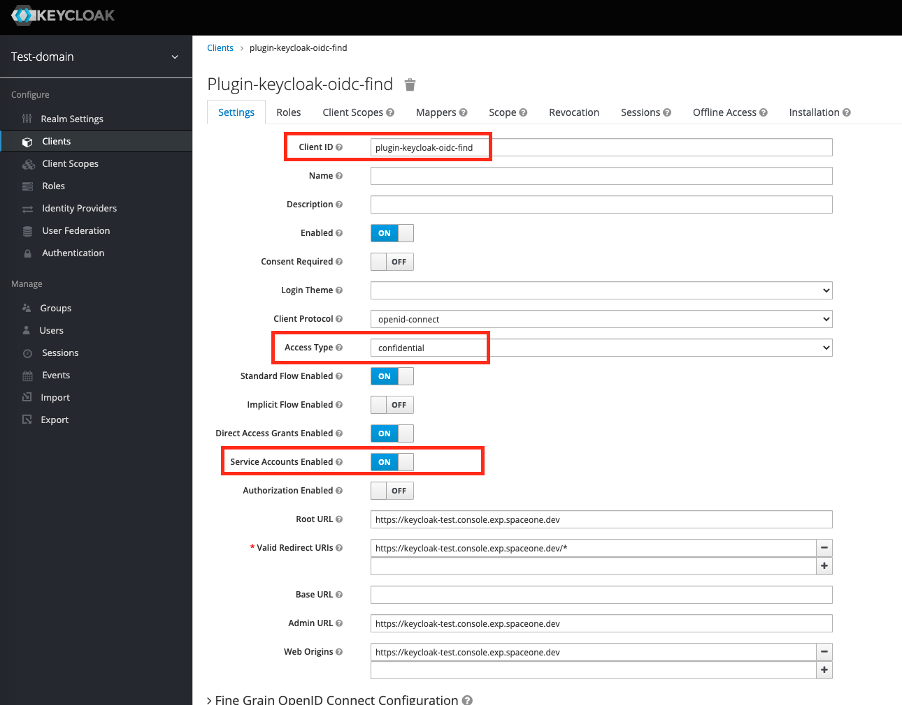
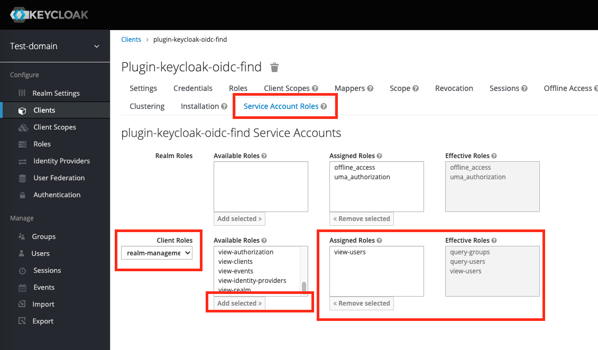

# Keycloak Auth Plugin

**Keycloak Auth Plugin** provides SSO(Single Sign On) on SpaceONE using Keycloak identity and access solution.

# Keycloak configuration

To enable plugin-keycloak-oidc, you needs two clients,

| Client ID | Description |
| ---    | ----        |
| plugin-keycloak-oidc-login | For login user |
| plugin-keycloak-oidc-find  | For find users   |

> **_NOTE:_**
> Below example is based on
>You have created **_keycloak-test_** domain on SpaceONE like **https://keycloak-test.console.exp.spaceone.dev**

## plugin-keycloak-oidc-login

***1. Create keycloak client for User login.***

> **_NOTE:_**
> The name of Client ID is any string what you want.
> Root URL is the main URL of your SpaceONE web page.
> For example, if you create mycompany as SpaceONE domain.
> the Root URL is https://mycompany.console.example.com

***2. Check Settings***

> **_NOTE:_**
> ***Access Type*** should be ***public*** which is default

## plugin-keycloak-oidc-find

***1. Create keycloak client for User find.***

***2. Check Settings***

> **_NOTE:_**
> ***Access Type*** should be ***confidential***
> Enable ***Service Accounts Enabled***

> **_NOTE__**
> After changing values, click **_Save_**.

***3. Check Credentials***

If you change ***Acess Type*** as ***confidential***, ***Credentials*** menu is visible.

> **_NOTE:_**
> You have to keep ***secret*** for plugin_info.

***4. Configure Service Account Roles***

If you enable ***Service Accounts Enabled***, ***Service Account Roles*** menu is visible.

Configure ***Client Roles*** with ***realm-management***.

> **_NOTE:_**
> You have to select ***view-users***.

**_All configuration in Keycloak is finished._**

# Use Keycloak Auth Plugin

> **_Assumption_**
> keycloak-test domain is already created.

~~~
root@identity-558f967fb6-w9m9d:~# spacectl list domain
 domain_id           | name          | state   | plugin_id   | plugin_version   | auth_type   | tags   | created_at
---------------------+---------------+---------+-------------+------------------+-------------+--------+--------------------------
 domain-a3819da36994 | keycloak-test | ENABLED |             |                  |             | {}     | 2021-07-15T04:19:12.716Z
~~~

There is no configuration about plugin_info.

## Using spacectl command

To use Keycloak auth plugin, use ***plugin-keycloak-oidc*** plugin.
You can change auth plugin as ***change_auth_plugin*** API.

Save plugin_info as keycloak.yaml file.

~~~YAML
plugin_info:
  options:
    auth_type: keycloak_oidc
    openid-configuration: https://sso.stargate.spaceone.dev/auth/realms/test-domain/.well-known/openid-configuration
    client_id: plugin-keycloak-oidc-login
  plugin_id: plugin-keycloak-oidc
  secret_data:
    client_id: plugin-keycloak-oidc-find
    client_secret: 60ace5b1-1ed0-4860-88bc-6cd65dd4fb2b
  version: '1.0'
~~~

> **_NOTE_**
You have to change values on your environments below:
* plugin_info.options.openid-configuration
* plugin_info.options.secret_data.client_secret
* version

**Run change_auth_plugin API** with spacectl

~~~
root@identity-558f967fb6-w9m9d:~# spacectl exec change_auth_plugin identity.Domain -f keycloak.yaml
---
config: {}
created_at: '2021-07-15T04:19:12.716Z'
domain_id: domain-a3819da36994
name: keycloak-test:wq
plugin_info:
  metadata:
    authorization_endpoint: https://sso.stargate.spaceone.dev/auth/realms/test-domain/protocol/openid-connect/auth
    end_session_endpoint: https://sso.stargate.spaceone.dev/auth/realms/test-domain/protocol/openid-connect/logout
    issuer: https://sso.stargate.spaceone.dev/auth/realms/test-domain
    realm: test-domain
    token_endpoint: https://sso.stargate.spaceone.dev/auth/realms/test-domain/protocol/openid-connect/token
    user_find_url: https://sso.stargate.spaceone.dev/auth/admin/realms/test-domain/users
    userinfo_endpoint: https://sso.stargate.spaceone.dev/auth/realms/test-domain/protocol/openid-connect/userinfo
  options:
    auth_type: keycloak_oidc
    client_id: plugin-keycloak-oidc-login
    openid-configuration: https://sso.stargate.spaceone.dev/auth/realms/test-domain/.well-known/openid-configuration
  plugin_id: plugin-keycloak-oidc
  secret_id: secret-e76a25b4da84
  version: '1.0'
state: ENABLED
tags: {}
~~~

After execute API, check domain information.

~~~
root@identity-558f967fb6-w9m9d:~# spacectl list domain
 domain_id           | name          | state   | plugin_id            |   plugin_version | auth_type     | tags   | created_at
---------------------+---------------+---------+----------------------+------------------+---------------+--------+--------------------------
 domain-a3819da36994 | keycloak-test | ENABLED | plugin-keycloak-oidc |              1.0 | keycloak_oidc | {}     | 2021-07-15T04:19:12.716Z
~~~

